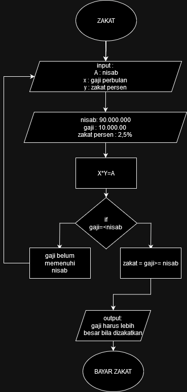

## (studi kasus) 
zakat yaitu hal wajib bagi umat muslim dimana dilaksanakan di bulan ramadhan/sebelum sholat idul fitri , zakat mall atau yang kita sebut adalah zakat orang yang mempunyai penghasilan lebih dari cukup ,dimana orang wajib hukumnya melakukan zakat mall berupa nilai 2,5% dari penghasilan pertahun dengan nisab 85gram emas atau setara dengan 85juta lebih.

## flowchart

